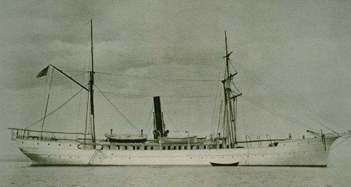
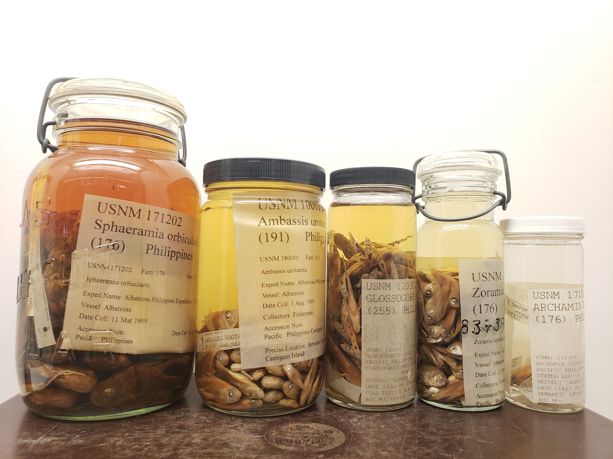

#  Welcome to the Albatross Re-Collection Project! 

The Albatross Re-Collection Project is a multi-year collaboration between Filipino and American scientists and universities funded by the National Science Foundation. 

Over a century ago, the [USS Albatross](https://ocean.si.edu/human-connections/exploration/deep-sea-research-100-years-ago-us-fisheries-steamer-albatross) collected fishes from the Philippines, now stored at the Smithsonian Institution. Surprisingly, the samples were never fixed in formalin, which would have altered the DNA. The collection therefore provide an incredibly archive of century-old fish genomes and rare insights into how fish have evolved in response to fishing, habitat loss, and other challenges. The Albatross Re-Collection Project is now comparing historical and modern fish genomes and phenotypes to test for evolution and to understand its consequences and implications. The research findings can help understand adaptation across many species facing similar challenges. The project also supports paid research internships for students with limited access to careers in science, and hosts workshops to foster international exchange with the Philippines. 

In this repository, you can learn about the research carried out by the project staff and REU students, find links to our products and publications, and find resources provided in our summer genomics workshops.

## Participants
Partners on the U.S. side of the collaboration include the [University of California Santa Cruz](https://globalchange.sites.ucsc.edu/), [Texas A&M University – Corpus Christi](https://www.tamucc.edu/science/research/genomics/), [Old Dominion University](https://www.odu.edu/directory/kent-carpenter), and the [Smithsonian National Museum of Natural History](https://naturalhistory.si.edu/research/vertebrate-zoology/fishes). On the Philippines side, scientists at [Silliman University](http://su.edu.ph/), the [National Fisheries Research & Development Institute](http://www.nfrdi.da.gov.ph/), the [University of the Philippines](https://msi.upd.edu.ph/faculty/rene-abesamis/), and [Mindanao State University](http://www.msumain.edu.ph/) in the Philippines to advance our understanding of genetic and species transformations in the epicenter of marine biodiversity. The project is currently led by Malin Pinsky, Chris Bird, Brendan Reid, Nadia Palomar-Abesamis, and Kent Carpenter.

## Education and training
* [Summer 2025 demographic inference workshop](https://github.com/GCRG-edu/Demographic_Inference_Training), University of the Philippines, Cebu City, Philippines
* [Research Experience for Undergraduates](https://sites.wp.odu.edu/PIRE/educational-initiatives/reu/) (2018-2022)
  * [REU projects](https://github.com/philippinespire/REUs)
* [Summer 2022 PIRE Omics Workshop](https://github.com/philippinespire/2022_PIRE_omics_workshop), Silliman University, Dumaguete City, Philippines
* [2022 Scientific Computing Virtual Workshop](https://github.com/philippinespire/PIRE_Virtual_Workshop)
* [2020 Python Workshop](https://github.com/philippinespire/CarpenterLabPythonWorkshop)
* [2019 Genomiecs, GitHub, and R Workshop](https://github.com/philippinespire/GenomicsWorkshop), Silliman University, Dumaguete City, Philippines

## Data and methods
* [Authorship Guidelines](https://docs.google.com/document/d/1MTHa2DemKsfxZmBt7KlGVEn7_PEX_ANer-Jd0T7J8iA/edit?usp=sharing)
* [Table of genomics data available](data.md)
* [Sampling map](https://www.google.com/maps/d/viewer?ll=13.778840586088801%2C121.06196765909733&z=10&mid=1leLurkYXC3FezrY59AhoU0QTjvi4fsIl)
* Bioinformatics pipelines
  * [Short-read quality control and processing](https://github.com/philippinespire/pire_fq_gz_processing)
  * [Shotgun sequencing genome assembly](https://github.com/philippinespire/pire_ssl_data_processing)
  * [Capture shotgun sequencing libraries (CSSL) genotyping](https://github.com/philippinespire/pire_cssl_data_processing)
  * Low-coverage whole genome sequencing (lcWGS) pipeline
* NCBI resources
  * [Genome assemblies](https://www.ncbi.nlm.nih.gov/bioproject/1134677)
  * [Tables of NCBI accession numbers](https://github.com/philippinespire/database_albatross_recollections/tree/main/db_files/sequence_info_sheets) in our project database
* [Genomic sequencing metadata on GEOME](https://geome-db.org/workbench/project-overview)
* [Project sampling and sequencing database](https://github.com/philippinespire/database_albatross_recollections)

## Publications
* NSF list for the Albatross Re-Collection project (2024-2026) ([UCSC](https://www.nsf.gov/awardsearch/showAward?AWD_ID=2343787), [TAMUCC](https://www.nsf.gov/awardsearch/showAward?AWD_ID=2343790), [ODU](https://www.nsf.gov/awardsearch/showAward?AWD_ID=2343788), [Rutgers](https://www.nsf.gov/awardsearch/showAward?AWD_ID=2343789))
* [NSF list for the Philippines PIRE project (2017-2023)](https://www.nsf.gov/awardsearch/showAward?AWD_ID=1743711&HistoricalAwards=false)

## Other resources
* The older [Philippines PIRE website](https://sites.wp.odu.edu/PIRE/)
* [Photo](https://www.biodiversitylibrary.org/item/138580#page/211/mode/1up) of the original clay jars the specimens were housed in (see page 205)
* [Popular science article](https://en.wikisource.org/wiki/Popular_Science_Monthly/Volume_78/March_1911/The_Work_of_the_Albatross_in_the_Philippines) from 1921 on the Albatross expedition
* Read [The Great Albatross Philippine Expedition and Its Fishes](https://sites.wp.odu.edu/PIRE/wp-content/uploads/sites/757/2019/02/Smith-and-Williams-1999-albatross-philippine-expedition.pdf) to learn more about this historic voyage.
* [Press release on 2018 workshop](https://su.edu.ph/us-science-foundation-funded-bioinformatics-workshop-in-su-trains-filipino-american-researchers/)

